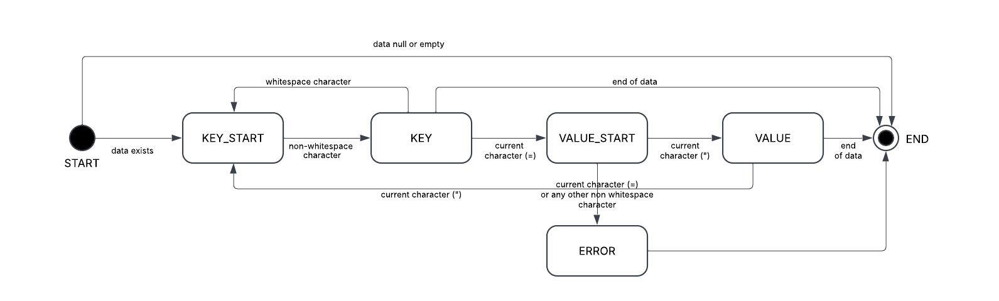

# Fintite State Machine Parser for Processing Instrction Data

When parsing an XML document, the parser encounters the Processing Instruction named "xmute" it calls the PiDataParser to parse the data content. In case data exists the FSMs initial state is `START`. If the string being processed is null or empty, the process ends by transitioning to the END state. If it is not, the machine transitions to the next state, KEY_START.

In this state, it checks whether the current character is a whitespace character. If it is, the machine looks for the next non-whitespace character and transitions to the KEY state (this also happens if the current character is not a whitespace).

In the KEY state, the machine processes each character one by one until it forms the key. If the first character is whitespace, the machine transitions back to the KEY_START state. If the current character is '=', the machine transitions to the VALUE_START state. If the end of the string is reached while forming the key, the key is added with an empty value, and the machine transitions to the END state.

When the machine is in the VALUE_START state, it skips whitespace characters and tabs until it encounters a double quote ("), which indicates that it has reached the value, and the machine transitions to the VALUE state. If the machine encounters a equal (=) character, it transitions to the ERROR state.

In the VALUE state, the machine processes each character one by one until it forms the value. If it encounters a backslash (\), it sets the escape flag. If it encounters a quote character (") and the escape flag is not set, it adds the key-value entry to the data entry and transitions back to the KEY_START state. If the end of the string is reached, the key-value pair is added to the data entry map, and the process ends by transitioning to the END state.

The ERROR state logs the error and transitions to the END state.

The END state is the final state, and the process ends.

